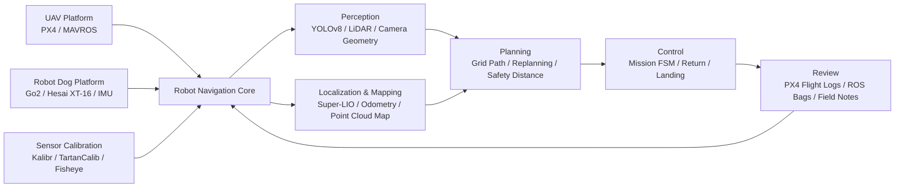

```markdown
<p align="center">
  
</p>

<p align="center">
  
</p>

<p align="center">
  <a href="https://github.com/u5-4">
    
  </a>
  <a href="https://github.com/u5-4?tab=repositories">
    
  </a>
  
  
</p>

---

## Hi, I'm `neck_deep`

我主要做 **机器人导航与多传感器工程部署**，方向集中在：

- **无人机自主飞行**：PX4、MAVROS、任务状态机、路径规划、目标识别、返航与降落。
- **四足机器人 SLAM / Navigation**：Unitree Go2、Hesai XT-16、Go2 内部 IMU、ROS1 Noetic、Super-LIO。
- **感知与标定**：鱼眼相机、Kalibr / TartanCalib、相机几何、3D reconstruction、LiDAR / IMU 时间同步。
- **真实硬件调试**：Jetson / Orin NX、Ubuntu、ROS 环境、驱动编译、日志分析、现场部署文档。

我的定位不是只写算法 demo，而是把算法、传感器、机器人本体、网络、时间戳、ROS 话题、启动脚本和调试记录连成能跑起来的系统。

---

## Navigation Console

```text
CALLSIGN       : neck_deep / u5-4
MAIN FIELD     : Robot Navigation & Field Robotics
UAV STACK      : PX4 + MAVROS + YOLOv8 + Path Planning + Mission FSM
ROBOT DOG      : Unitree Go2 + Hesai XT-16 + Go2 IMU + Super-LIO
PERCEPTION     : LiDAR / IMU / Fisheye Camera / Calibration / Geometry
COMPUTE        : Ubuntu / ROS1 Noetic / Jetson / Orin NX / C++ / Python
OUTPUT         : Odometry / Map / Flight Logs / ROS Bags / Deployment Notes
ENGINEERING    : Build -> Test -> Log -> Debug -> Document -> Relaunch
```

---

## Core Tracks

| Track | What I build | Representative Repos |
|---|---|---|
| UAV Autonomous Navigation | 无人机任务流程、路径规划、避障、目标识别、PX4/MAVROS 控制、返航与降落 | [`-A-`](https://github.com/u5-4/-A-), [`px4-flight-review-full-guide`](https://github.com/u5-4/px4-flight-review-full-guide) |
| Robot Dog SLAM | Go2 四足机器人外接 Hesai XT-16，融合 Go2 内部 IMU，跑 Super-LIO 定位建图 | [`GO2_Hesai`](https://github.com/u5-4/GO2_Hesai) |
| Sensor Calibration | J200 / 鱼眼相机 / Kalibr / TartanCalib / AprilTag / 相机与 IMU 标定 | [`J200-Fisheye-Calibration-Startup`](https://github.com/u5-4/J200-Fisheye-Calibration-Startup), [`tartancalib`](https://github.com/u5-4/tartancalib) |
| Vision Geometry | 计算机视觉、相机模型、单视图几何、消失点、PnP、3D reconstruction 基础 | [`computer-vision-notes`](https://github.com/u5-4/computer-vision-notes) |
| Deployment Notes | Jetson / Ubuntu / ROS1 Noetic / NVIDIA 环境编译与部署记录 | [`Ubunth22.4_ROS1_noetic_nvidia`](https://github.com/u5-4/Ubunth22.4_ROS1_noetic_nvidia) |
| Model Assets | D435I / LiDAR SLAM 相关 3D 模型与工程素材 | [`3D_Model`](https://github.com/u5-4/3D_Model) |

---

## Featured Project: Go2 + Hesai XT-16 + Super-LIO

[`GO2_Hesai`](https://github.com/u5-4/GO2_Hesai) 是我当前四足机器人导航方向的核心工程之一。

```text
Hesai XT-16
    -> hesai_ros_driver
    -> /lidar_points

Go2 Internal IMU
    -> Unitree SDK2 / DDS / rt/lowstate
    -> go2_imu_bridge
    -> /imu/data

/lidar_points + /imu/data
    -> Super-LIO
    -> /lio/odom
    -> /lio/cloud_world
```

这个仓库重点记录：

- Hesai XT-16 网络参数、端口、点云话题配置。
- Go2 内部 IMU 通过 Unitree SDK2 / DDS 转 ROS1 `/imu/data`。
- LiDAR 与 IMU 时间戳对齐。
- Super-LIO 参数、外参、重力模长、话题配置。
- 一键启动脚本与定位结果检查命令。
- 从驱动、话题、时间同步到 SLAM 输出的完整部署链路。

---

## Featured Project: UAV Autonomous Mission

[`-A-`](https://github.com/u5-4/-A-) 面向无人机自主飞行任务，核心目标是让无人机在已知或动态变化环境中安全完成任务。

主要模块包括：

- 地图 / 栅格 / 航点输入。
- 障碍物检测与安全距离约束。
- 路径规划与实时重规划。
- 速度、姿态、航向控制指令输出。
- 起飞、巡航、绕障、到点悬停、返航、降落任务流程。
- YOLOv8 视觉识别与任务状态机结合。
- PX4 / MAVROS 调试与飞行日志分析。

---

## Tech Stack

<p align="center">
  
</p>

<p align="center">
  
  
  
  
  
  
  
  
  
</p>

---

## System Map



---

## Project Radar

| Repo | Role in My Stack |
|---|---|
| [`GO2_Hesai`](https://github.com/u5-4/GO2_Hesai) | 四足机器人 LiDAR-IMU SLAM 工程链路，Go2 + Hesai XT-16 + Super-LIO。 |
| [`-A-`](https://github.com/u5-4/-A-) | 无人机自主飞行任务核心代码，路径规划、控制、任务状态机与视觉感知。 |
| [`px4-flight-review-full-guide`](https://github.com/u5-4/px4-flight-review-full-guide) | PX4 Flight Review 中文学习与飞行日志诊断笔记。 |
| [`J200-Fisheye-Calibration-Startup`](https://github.com/u5-4/J200-Fisheye-Calibration-Startup) | J200 四鱼眼相机标定、rosbag、Kalibr、Orin NX 参数部署流程。 |
| [`computer-vision-notes`](https://github.com/u5-4/computer-vision-notes) | 计算机视觉与 3D reconstruction 学习笔记。 |
| [`Ubunth22.4_ROS1_noetic_nvidia`](https://github.com/u5-4/Ubunth22.4_ROS1_noetic_nvidia) | Ubuntu 22.04 / Jetson ARM64 / ROS1 Noetic 环境部署记录。 |
| [`3D_Model`](https://github.com/u5-4/3D_Model) | D435I 视觉 SLAM 与 LiDAR SLAM 相关模型素材。 |
| [`tartancalib`](https://github.com/u5-4/tartancalib) | 广角相机标定方向的学习与工具参考。 |

---

## GitHub Telemetry

<p align="center">
  
  
</p>

<p align="center">
  
</p>

<p align="center">
  
</p>

<p align="center">
  
</p>

---

## Pinned Launch Modules

<p align="center">
  <a href="https://github.com/u5-4/GO2_Hesai">
    
  </a>
  <a href="https://github.com/u5-4/-A-">
    
  </a>
</p>

<p align="center">
  <a href="https://github.com/u5-4/px4-flight-review-full-guide">
    
  </a>
  <a href="https://github.com/u5-4/computer-vision-notes">
    
  </a>
</p>

---

## Current Orbit

- 正在强化 **四足机器人 LiDAR-IMU SLAM** 的工程稳定性。
- 持续整理 **PX4 飞行日志分析** 与无人机调参经验。
- 学习并实践 **相机标定、鱼眼模型、3D reconstruction**。
- 把每次真实硬件调试变成可复现的 README、脚本和排错流程。

---

## Motto

> Build it, fly it, log it, debug it, document it, launch again.

<p align="center">
  
</p>

<p align="center">
  
</p>
```
