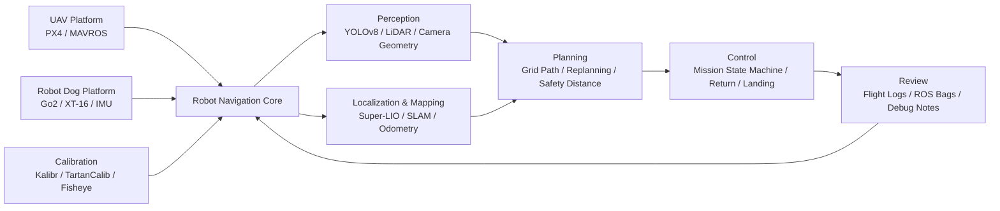

<p align="center">
  
</p>

<p align="center">
  
</p>

<p align="center">
  <a href="https://github.com/u5-4">
    
  </a>
  <a href="https://github.com/u5-4?tab=repositories">
    
  </a>
  
  
</p>

---

## Hi, I'm `neck_deep`

My main direction is **robot navigation**: autonomous UAV missions, robot dog LiDAR/IMU SLAM, PX4/MAVROS control, sensor calibration, and field debugging.

我更关注真实机器人系统里那些“必须全部对上才会跑”的部分：驱动、网络、时间戳、ROS 话题、传感器外参、启动脚本、日志分析和现场部署记录。

```text
Identity      : Robotics / UAV / SLAM field engineer
Core Field    : Robot Navigation
Main Stack    : PX4 + MAVROS + ROS1 Noetic + Super-LIO
Robot Dog     : Unitree Go2 + Hesai XT-16 + Go2 internal IMU
UAV           : Autonomous mission + perception + path planning + control
Perception    : LiDAR / IMU / fisheye camera / calibration / 3D geometry
Compute       : Jetson / Orin NX / Ubuntu / NVIDIA / C++ / Python
Output        : odometry, maps, flight logs, launch scripts, reusable notes
```

---

## Main Direction

| Track | What I work on | Representative repo |
|---|---|---|
| UAV navigation | PX4/MAVROS control, autonomous mission state machine, target detection, path planning, return and landing flow | [`-A-`](https://github.com/u5-4/-A-) |
| Robot dog navigation | Unitree Go2, Hesai XT-16 LiDAR, Go2 IMU bridge, ROS1 Noetic, Super-LIO odometry and mapping | [`GO2_Hesai`](https://github.com/u5-4/GO2_Hesai) |
| Perception and calibration | Fisheye camera calibration, Kalibr/TartanCalib, camera geometry, 3D reconstruction notes | [`J200-Fisheye-Calibration-Startup`](https://github.com/u5-4/J200-Fisheye-Calibration-Startup), [`computer-vision-notes`](https://github.com/u5-4/computer-vision-notes) |
| Deployment and debugging | Jetson / Orin NX, Ubuntu, ROS environment, NVIDIA driver, source build and troubleshooting | [`Ubunth22.4_ROS1_noetic_nvidia`](https://github.com/u5-4/Ubunth22.4_ROS1_noetic_nvidia) |

---

## Mission Control

```text
[ UAV AUTONOMY ]
PX4 -> MAVROS -> Mission FSM -> Path Planning -> Control -> Flight Review

[ ROBOT DOG SLAM ]
Hesai XT-16 -> /lidar_points
Go2 DDS IMU -> go2_imu_bridge -> /imu/data
/lidar_points + /imu/data -> Super-LIO -> /lio/odom -> /lio/cloud_world

[ SENSOR CALIBRATION ]
Fisheye Camera -> rosbag -> Kalibr / TartanCalib -> Extrinsic / Intrinsic -> Deployment

[ FIELD DEBUGGING ]
Network -> Driver -> Timestamp -> Topic -> TF / Extrinsic -> Log -> README
```

---

## Tech Stack

<p align="center">
  
</p>

<p align="center">
  
  
  
  
  
  
  
  
  
  
  
</p>

---

## Robot Dog Navigation

The [`GO2_Hesai`](https://github.com/u5-4/GO2_Hesai) project records a stable navigation and mapping chain for a **Unitree Go2 robot dog** with a **Hesai XT-16 LiDAR** and the Go2 internal IMU.

```text
Hesai XT-16
  -> Hesai ROS Driver
  -> /lidar_points

Go2 internal IMU
  -> Unitree SDK2 DDS rt/lowstate
  -> go2_imu_bridge
  -> /imu/data

/lidar_points + /imu/data
  -> Super-LIO
  -> /lio/odom
  -> /lio/cloud_world
```

This project focuses on the full field chain: network configuration, LiDAR driver, DDS-to-ROS1 IMU bridge, timestamp alignment, topic verification, Super-LIO parameters, launch scripts, and mapping stability.

---

## UAV Autonomous Navigation

The [`-A-`](https://github.com/u5-4/-A-) project is focused on autonomous UAV mission logic.

```text
Map / Grid / Waypoints
  -> Path Planning
  -> Obstacle Avoidance
  -> Mission State Machine
  -> PX4 / MAVROS Control
  -> Return / Landing
  -> Flight Review
```

It covers target detection, route generation, safety distance, replanning, speed / attitude / yaw command output, and practical debugging flow for UAV competition-style tasks.

---

## Featured Projects

| Project | Focus | Notes |
|---|---|---|
| [`GO2_Hesai`](https://github.com/u5-4/GO2_Hesai) | Robot dog LiDAR/IMU navigation | Unitree Go2 + Hesai XT-16 + Go2 internal IMU + ROS1 Noetic + Super-LIO. Records `/lidar_points`, `/imu/data`, `/lio/odom`, `/lio/cloud_world`, timestamp alignment, launch scripts, and stability checks. |
| [`-A-`](https://github.com/u5-4/-A-) | UAV autonomous navigation | ROS-based UAV project with YOLOv8 perception, grid path planning, task scheduling, MAVROS/PX4 control, return strategy, takeoff, cruising, obstacle avoidance, delivery, and landing. |
| [`J200-Fisheye-Calibration-Startup`](https://github.com/u5-4/J200-Fisheye-Calibration-Startup) | J200 four-fisheye calibration | End-to-end workflow for rosbag recording, Kalibr calibration, Orin NX parameter deployment, report reading, IMU joint calibration, and troubleshooting. |
| [`Ubunth22.4_ROS1_noetic_nvidia`](https://github.com/u5-4/Ubunth22.4_ROS1_noetic_nvidia) | Jetson ARM64 ROS1 Noetic | Source-build notes for ROS1 Noetic on Ubuntu 22.04 Jammy / Jetson ARM64, including environment isolation and common problems. |
| [`px4-flight-review-full-guide`](https://github.com/u5-4/px4-flight-review-full-guide) | PX4 log analysis | Chinese study guide for PX4 Flight Review: PID tracking, vibration, GPS, EKF flags, actuator outputs, estimator health, and flight debugging order. |
| [`computer-vision-notes`](https://github.com/u5-4/computer-vision-notes) | 3D reconstruction notes | Camera geometry, single-view geometry, vanishing points, projective transforms, least squares, and the math foundation for calibration / PnP / BA. |
| [`3D_Model`](https://github.com/u5-4/3D_Model) | SLAM model assets | 3D model drawings for D435I visual SLAM and LiDAR SLAM versions. |
| [`tartancalib`](https://github.com/u5-4/tartancalib) | Wide-angle calibration | TartanCalib / Kalibr-based wide-angle lens calibration workflow using AprilTags and adaptive subpixel refinement. |

---

## Robotics Pipeline



---

## Current Orbit

- Focusing on **robot navigation** across UAVs and robot dogs.
- Building reliable **ROS deployment records** for real robotics hardware.
- Connecting **Hesai XT-16 + Go2 IMU + Super-LIO** for robot dog odometry and mapping.
- Organizing **PX4 Flight Review** knowledge into practical UAV debugging checklists.
- Studying **computer vision / 3D reconstruction** from geometry to optimization.
- Turning field problems into reproducible launch scripts, parameter notes, and README documents.

---

## GitHub Telemetry

<p align="center">
  
  
</p>

<p align="center">
  
</p>

<p align="center">
  
</p>

<p align="center">
  
</p>

---

## Pinned Launch Modules

<p align="center">
  <a href="https://github.com/u5-4/GO2_Hesai">
    
  </a>
  <a href="https://github.com/u5-4/-A-">
    
  </a>
</p>

<p align="center">
  <a href="https://github.com/u5-4/px4-flight-review-full-guide">
    
  </a>
  <a href="https://github.com/u5-4/computer-vision-notes">
    
  </a>
</p>

---

## Motto

> Build it, fly it, log it, debug it, document it, launch again.

<p align="center">
  
</p>

<p align="center">
  
</p>
